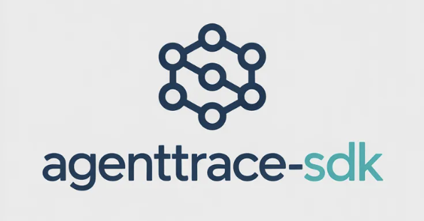

<p align="center">
  
</p>
<p align="center">Cross-agent observability for AI workflows — the call stack for AI.</p>

[](https://www.npmjs.com/package/agenttrace-sdk)
[](./LICENSE)
[](./test)

## Why

Multi-agent workflows fail silently. When a pipeline burns $40 in one run, loops a tool call 50 times, or cascades errors across three agents, you have no call stack to inspect — only a final result (or none). Existing observability tools are SaaS platforms that require sending your data to a third party, ingesting via SDKs designed for microservices, or running a separate infrastructure stack.

AgentTrace is an embeddable TypeScript library. Drop it into any agent codebase, point it at a SQLite file (or `:memory:`), and get structured traces, cost attribution, anomaly detection, and flame graph export with no external dependencies beyond the database file.

## Features

- **Trace collection** — OTel-compatible span collection for LLM calls, tool calls, inter-agent messages, decisions, and workflow spans
- **Cost attribution** — per-call cost calculation across 20+ models; breakdown by agent, model, or workflow
- **Anomaly detection** — rolling EMA baselines per agent; detects cost spikes, latency spikes, token spikes, error cascades, loop detection, and unusual tool frequency
- **Flame graph export** — reconstructs hierarchical execution trees from flat spans; exports d3-flame-graph compatible JSON
- **OTLP export** — send any trace to Jaeger, Grafana Tempo, Langfuse, or any OpenTelemetry-compatible collector via OTLP/HTTP
- **SQLite persistence** — WAL-mode SQLite via better-sqlite3; zero-config in-memory option for tests
- **Embeddable** — plain TypeScript library, no daemon, no network calls, no platform account

## Install

```
npm install agenttrace-sdk
```

Requires Node 18+ and a native build toolchain for `better-sqlite3` (standard on most systems).

## Quick Start

```ts
import {
  TraceStore,
  TraceCollector,
  CostAttributor,
  FlameGraphBuilder,
  AnomalyDetector,
} from "agenttrace-sdk";

const store = new TraceStore("./traces.db");
const collector = new TraceCollector({ store });
const costs = new CostAttributor(store);
const flames = new FlameGraphBuilder(store);
const anomalies = new AnomalyDetector(store);

// Start tracing a workflow
const traceId = collector.startTrace("workflow-123");

// Record agent activities
collector.recordLlmCall(traceId, {
  model: "claude-sonnet-4-6",
  prompt_tokens: 1500,
  completion_tokens: 800,
  duration_ms: 2300,
  agent_id: "planner",
});

// End trace and get summary
const trace = collector.endTrace(traceId);

// Query costs by agent
const breakdown = costs.getCostBreakdown("workflow-123");

// Generate flame graph JSON for visualization
const flameJson = flames.exportJson(traceId);
```

For in-memory usage (e.g., tests):

```ts
const store = new TraceStore(":memory:");
```

## API Reference

### TraceStore

SQLite-backed persistence layer. Stores spans, traces, cost records, agent baselines, and anomaly alerts.

| Method | Params | Returns | Description |
|--------|--------|---------|-------------|
| `constructor` | `dbPath: string = ":memory:"` | — | Opens or creates the database; enables WAL mode |
| `insertSpan` | `span: Span` | `void` | Persists a span |
| `getSpan` | `spanId: string` | `Span \| null` | Retrieves a single span |
| `getSpans` | `traceId: string` | `Span[]` | All spans for a trace, ordered by start time |
| `searchSpans` | `query: string` | `Span[]` | Full-text search on span name and attributes (limit 100) |
| `upsertTrace` | `trace: Trace` | `void` | Insert or update a trace record |
| `getTrace` | `traceId: string` | `Trace \| null` | Retrieves a trace by ID |
| `listTraces` | `filter?: TraceFilter` | `Trace[]` | Filtered trace listing (default limit 50) |
| `insertCostRecord` | `record: CostRecord` | `void` | Persists a cost record |
| `getCostsByWorkflow` | `workflowId: string` | `CostRecord[]` | All cost records for a workflow |
| `getCostsByAgent` | `agentId: string` | `CostRecord[]` | All cost records for an agent |
| `getCostsByTrace` | `traceId: string` | `CostRecord[]` | All cost records for a trace |
| `getBaseline` | `agentId: string` | `BaselineMetrics \| null` | Current EMA baseline for an agent |
| `updateBaseline` | `agentId: string, sample: Partial<BaselineMetrics>` | `void` | Updates rolling EMA baseline with a new sample |
| `insertAnomaly` | `alert: AnomalyAlert` | `void` | Persists an anomaly alert |
| `getAnomaliesByTrace` | `traceId: string` | `AnomalyAlert[]` | Anomalies for a trace |
| `getAnomaliesByAgent` | `agentId: string` | `AnomalyAlert[]` | Anomalies for an agent (most recent first) |
| `close` | — | `void` | Closes the database connection |

`TraceFilter` fields: `start_time`, `end_time`, `agent_id`, `workflow_id`, `status`, `min_cost`, `max_cost`, `has_anomaly`, `limit`, `offset`.

---

### TraceCollector

OTel-compatible span collection. Wraps span creation and persistence; auto-calculates costs on LLM calls.

Constructor: `new TraceCollector({ store, serviceName?, costCalculator? })`

| Method | Params | Returns | Description |
|--------|--------|---------|-------------|
| `startTrace` | `workflowId?: string` | `string` | Opens a new trace; returns `trace_id` |
| `recordLlmCall` | `traceId, attrs` | `Span` | Records an LLM call span; auto-calculates cost |
| `recordToolCall` | `traceId, attrs` | `Span` | Records a tool call span |
| `recordMessage` | `traceId, attrs` | `Span` | Records an inter-agent message span |
| `recordDecision` | `traceId, attrs` | `Span` | Records a decision point span |
| `recordWorkflow` | `traceId, attrs` | `Span` | Records a workflow root span |
| `endTrace` | `traceId, status?` | `Trace \| null` | Finalizes trace with aggregate metrics |

`recordLlmCall` requires: `model`, `prompt_tokens`, `completion_tokens`, `duration_ms`, `agent_id`. Optional: `agent_name`, `parent_span_id`, `status`.

---

### CostCalculator

Computes dollar costs from model name and token counts. Ships with built-in pricing for 20+ models; pricing is configurable.

Constructor: `new CostCalculator(customPricing?: ModelPricing[])`

| Method | Params | Returns | Description |
|--------|--------|---------|-------------|
| `calculate` | `model: string, promptTokens: number, completionTokens: number` | `number` | Cost in USD; returns 0 for unknown models |
| `setPricing` | `pricing: ModelPricing` | `void` | Add or override a model's pricing |
| `getPricing` | `model: string` | `ModelPricing \| null` | Get pricing config for a model |
| `listPricing` | — | `ModelPricing[]` | All configured model pricings |

Model names support prefix matching: `"claude-sonnet-4-6-20260301"` matches `"claude-sonnet-4-6"`.

---

### CostAttributor

Aggregates cost records into breakdown reports by agent, model, or workflow.

Constructor: `new CostAttributor(store: TraceStore)`

| Method | Params | Returns | Description |
|--------|--------|---------|-------------|
| `getCostByWorkflow` | `workflowId: string` | `number` | Total cost for a workflow (USD) |
| `getCostByAgent` | `agentId: string` | `number` | Total cost for an agent across all traces (USD) |
| `getCostBreakdown` | `workflowId: string` | `CostBreakdownEntry[]` | Per-agent breakdown for a workflow |
| `getCostBreakdownByModel` | `traceId: string` | `CostBreakdownEntry[]` | Per-model breakdown for a trace |
| `getAgentCostBreakdown` | `agentId: string` | `CostBreakdownEntry[]` | Per-model breakdown for an agent |

Each `CostBreakdownEntry` includes: `key`, `label`, `total_cost`, `total_tokens`, `call_count`, `avg_cost_per_call`.

---

### FlameGraphBuilder

Reconstructs hierarchical execution trees from flat span records.

Constructor: `new FlameGraphBuilder(store: TraceStore)`

| Method | Params | Returns | Description |
|--------|--------|---------|-------------|
| `buildFlameGraph` | `traceId: string` | `FlameNode \| null` | Builds a `FlameNode` tree; wraps multiple roots in a synthetic root |
| `exportJson` | `traceId: string` | `string \| null` | d3-flame-graph compatible JSON (`name`, `value`, `children`, plus `cost`, `tokens`, `type`, `status`) |

---

### AnomalyDetector

Detects anomalous agent behavior against rolling EMA baselines.

Constructor: `new AnomalyDetector(store: TraceStore, config?: DetectorConfig)`

`DetectorConfig`: `spikeThreshold` (default 3), `loopThreshold` (default 5), `minSamples` (default 10).

| Method | Params | Returns | Description |
|--------|--------|---------|-------------|
| `analyzeSpan` | `span: Span` | `AnomalyAlert[]` | Checks a span for cost/latency/token spikes and error cascades; updates baselines |
| `analyzeTrace` | `traceId: string` | `AnomalyAlert[]` | Checks a completed trace for loop detection and unusual tool frequency |

Detection rules:
- **cost_spike** — LLM call cost exceeds `spikeThreshold`x agent average (critical at 10x)
- **token_spike** — token usage exceeds `spikeThreshold`x average
- **latency_spike** — span duration exceeds `spikeThreshold`x average (critical at 10x)
- **error_cascade** — error rate exceeds baseline by more than 20 percentage points
- **loop_detection** — same tool called more than `loopThreshold` times with similar args
- **unusual_tool_usage** — tool frequency exceeds 5x baseline average

Anomaly checks are skipped until an agent has at least `minSamples` baseline samples.

### OtlpExporter

Exports traces from the local SQLite store to any OpenTelemetry-compatible collector using OTLP/HTTP.

Constructor: `new OtlpExporter(store: TraceStore, options: OtlpExporterOptions)`

`OtlpExporterOptions`: `url` (required) — the OTLP/HTTP traces endpoint (e.g., `"http://localhost:4318/v1/traces"`). Additional options are forwarded to the underlying `@opentelemetry/exporter-trace-otlp-http` exporter.

| Method | Params | Returns | Description |
|--------|--------|---------|-------------|
| `constructor` | `store: TraceStore, options: OtlpExporterOptions` | — | Initializes the exporter with the given store and OTLP endpoint |
| `exportTrace` | `traceId: string` | `Promise<void>` | Exports all spans for a single trace to the configured collector |
| `exportAll` | `filter?: TraceFilter` | `Promise<void>` | Exports all traces matching an optional filter; uses the same `TraceFilter` as `TraceStore.listTraces` |
| `shutdown` | — | `Promise<void>` | Flushes pending exports and shuts down the underlying exporter |

```ts
import { TraceStore, TraceCollector, OtlpExporter } from "agenttrace-sdk";

const store = new TraceStore("./traces.db");
const collector = new TraceCollector({ store });
const exporter = new OtlpExporter(store, {
  url: "http://localhost:4318/v1/traces",
});

// ... record spans ...

// Export a trace to any OTel collector (Jaeger, Grafana Tempo, Langfuse, etc.)
await exporter.exportTrace(traceId);

// Export all traces matching a filter
await exporter.exportAll({ status: "error" });

// Cleanup
await exporter.shutdown();
```

---

## Supported Models

**Anthropic** — `claude-opus-4-6`, `claude-sonnet-4-6`, `claude-haiku-4-5`

**OpenAI** — `gpt-4o`, `gpt-4o-mini`, `gpt-4.1`, `gpt-4.1-mini`, `gpt-4.1-nano`, `o3`, `o3-mini`, `o4-mini`

**Google** — `gemini-2.5-pro`, `gemini-2.5-flash`, `gemini-2.0-flash`

**Meta** — `llama-4-scout`, `llama-4-maverick`

**Mistral** — `mistral-large`, `mistral-small`, `codestral`

**DeepSeek** — `deepseek-r1`, `deepseek-v3`

Custom models can be added via `CostCalculator`'s constructor or `setPricing`.

## License

MIT — see [LICENSE](./LICENSE)
